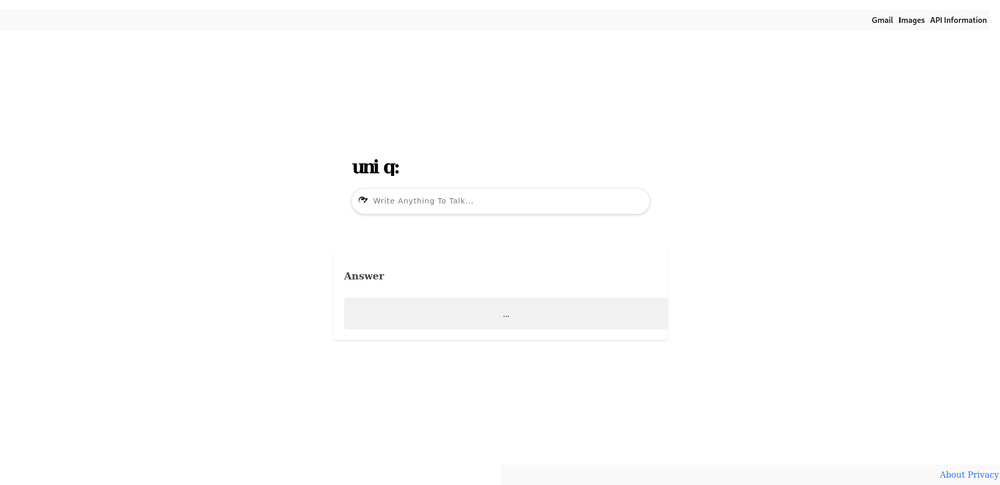

# Uniq-b GPT4 Clone With Python Gui

This is a simple Flask web application that uses the GPT-4All model to generate responses for user input.



## Prerequisites

- Python 3.x
- Flask
- GPT-4All Python library

## Installation

1. Clone this repository:

    ```bash
    git clone https://github.com/muslumhack/uniq-bllm.git
    cd your-repo
    ```

2. Install the required dependencies:

    ```bash
    pip install -r requirements.txt
    ```

3. Download the GPT-4All model file from [https://gpt4all.io/index.html](https://gpt4all.io/index.html) and place it in the project directory.

## Usage

1. Run the Flask application:

    ```bash
    python app.py
    ```

2. Visit `http://localhost:5000` in your web browser to interact with the chatbot.

## API Endpoint

- The app also provides a simple API endpoint (`/api`) for making POST requests to generate responses. You can use tools like `curl` or Postman for testing.

    ```bash
    curl -X POST -H "Content-Type: application/json" -d '{"msg":"Your message here"}' http://localhost:5000/api
    ```

## Example GET Request

- Alternatively, you can make a GET request to the `/get` endpoint by visiting the following URL in your browser:

    ```
    http://localhost:5000/get?msg=Your%20message%20here
    ```

## Update Model Integration Code

- Open the `app.py` file and locate the line where the GPT-4All model is initialized. Replace the existing model file name with the name of the model you downloaded.

    ```python
    # Update the model file name
    model = GPT4All("your-downloaded-model-file.gguf")
    ```

## Folder Structure

- `app.py`: Main Flask application file.
- `templates/`: HTML templates for rendering pages.
- `static/`: Static files (CSS, JavaScript, etc.).
- `gpt4all.py`: GPT-4All model integration file.

Make sure to download the GPT-4All model file from [https://gpt4all.io/index.html](https://gpt4all.io/index.html) and replace the existing model file name in the `app.py` file.
Feel free to customize the app according to your requirements.
